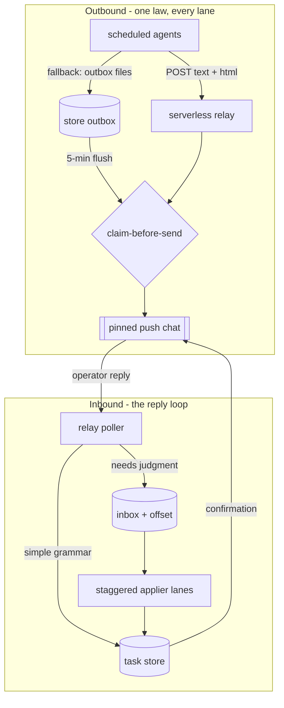

# Architecture

## Runtime

Ganesh OS runs on a desktop AI agent runtime that provides four primitives:

- **File tools** for a Markdown knowledge base on disk.
- **A sandboxed shell** for scripted work.
- **Scheduled tasks**: each agent is a `SKILL.md` prompt fired by cron in local time, running only while the host app is awake, serialized one at a time.
- **Connectors**: Apple Reminders, Apple Calendar, Google Calendar (six accounts), iMessage, WhatsApp, Slack, Gmail, Apple Notes.

Each scheduled run starts fresh with no memory of prior runs. All continuity lives in files. That constraint forces the whole design: state is external, every agent reloads context from disk, and coordination happens through shared files rather than shared memory.

## The five layers

**1. Capture and digest.** Per-channel agents (WhatsApp, iMessage, Slack, Google Voice, Gmail) read unread items twice a day, summarize each with a key quote, write the verbatim to a per-channel archive, and emit one phone-friendly SMS per channel. A meetings layer reconciles and briefs every meeting across Granola and Krisp. Nothing here mutates the task list directly; it surfaces and proposes.

**2. Triage.** Two agents tier every open reminder (now, this-week, later, prune) and set priority. One owns the pipeline; the other owns every other list. They write decision canvases - files with a stable handle and id per row and a blank decision column the human can edit from a file or a text.

**3. Reconcile and surface.** Two daily sweeps own dates: they reconcile reminders against six calendars, dedupe, resolve conflicts, advance recurring items, auto-park overdue, and enforce a per-day budget. Two briefings then read the triage canvases plus calendar plus messages and produce the ranked daily view (the single most important task plus a cross-domain top three) delivered to chat, a vault file, a phone-readable calendar event, and an SMS.

**4. Wellbeing coaching.** A morning weigh-in captures weight, sleep, and how the body feels; a readiness pass reads last night's recovery and recommends an energy-timed day (advisory only - it never writes dates); context-aware meal prompts carry coaching; a workout coach previews the day's training and nudges before each session, joint-aware; a sleep coach runs the wind-down. A silent metrics brain captures all of it, tracks the trends (weight, body-fat, sleep debt, macros, body-feeling, ritual adherence) with an adaptive-TDEE loop that calibrates calorie targets against the actual weight trend, and regenerates a holistic dashboard. Hydration and mind rituals ride one-way reminders, not extra pings.

**5. Reflect.** An end-of-day agent diffs the morning plan against what actually happened and grades the day with coaching. A weekly agent runs error analysis across the logs, lints the knowledge base for rot, runs the regression checks, and proposes at most one change per agent - diagnostic only, never self-deploying.

## Monitoring and delivery

The five layers above produce. A sixth, cross-cutting layer watches them and standardizes how they reach the human, so a silent failure cannot hide and every run proves it happened.

**Three system watchdogs.** A small `sys-` cohort sits above the producing fleet, none of it owning a domain field:

- **`sys-fleet-health`** (8:48a / 1:48p / 9:48p) reads every task's completion marker and classifies the fleet: missed slot, degraded run, mid-run crash (a run that stamped a start but left no completion), and connector outage. On the morning pass it sends one all-clear `N/N ran clean` heartbeat so a clean day still produces positive proof-of-life; the midday and evening passes stay silent unless something is missed or degraded.
- **`sys-catchup-controller`** (7a / 12p / 6p) re-fires the slots a closed laptop missed, re-anchored to now, freshness-gated so a stale slot is summarized-or-skipped rather than replayed. It is the external half of the two-class resilience contract: a run that never executed cannot heal itself, so something outside it must.
- **`sys-overdue-watchdog`** (8:37a) verifies the morning sweep actually drove overdue to zero and alerts only on an unexpected survivor, so the sweep's core promise is checked, not assumed.

**The delivery and notification contract.** Every producer obeys one uniform contract instead of each inventing its own delivery and alerting:

- **Three surfaces.** A substantive artifact (brief, digest, scoreboard, plan, careers-diff, dashboard) is delivered as chat, a Markdown file in the vault, and a self-contained light-mode HTML file. Pure one-line coaching prompts (the weigh-in, food, sleep, and workout nudges) are SMS-only by nature and exempt from the file surfaces.
- **A uniform run marker.** Every task, producer or prompt, writes one completion row to a single fleet-wide log on success, skip, or degrade. That one file is the substrate the watchdogs read; a task that also keeps a per-domain log writes the fleet marker too, so a mid-run crash is always detectable.
- **A success ping and a loud failure ping.** Success is the task's own tagged SMS (or a terse one-liner where it has none). The new path is failure: if a task's primary output fails, or a step still fails after the in-run retries, it sends a loud failure iMessage in addition to the central detection. The test is whether the task can still keep its core promise this run: if yes it degrades quietly with a "partial surface" note, if no it pings loudly.
- **The central heartbeat as the floor.** Above all the per-task pings, `sys-fleet-health`'s daily all-clear is the single proof that the whole fleet ran, so even a task that is silent by design is covered.

This layer is what turns "the agents ran" from a hope into a checked, delivered fact.

## The delivery and reply plane

Delivery earned its own plane after the v7.1 rollout, with one law across every lane and, since
v7.2, a closed loop back from the operator. Outbound: every substantive artifact ships as text
plus a self-contained html document to one pinned chat, through a serverless relay with real
egress as the primary path and a store outbox as the automatic fallback, joined by a
claim-before-send marker mutex so three redundant transports produce zero duplicates. Inbound: a
nightly review board numbers the store's decision points, the operator replies in natural grammar
from any surface, one relay poller captures the replies, simple commands apply deterministically
on the same 5-minute tick with an instant confirmation, and judgment commands fall to staggered
applier lanes within fifteen minutes. Measured round trip for a simple decision: under four
minutes, operator thumb to store write to confirmation.



The board-to-relay contract is a machine-readable handle map in the store (one pipe-delimited line
per decision item), so the deterministic layer resolves handles without guessing, and the
protected-tag rule means an operator-dated decision is never re-dated by any automation. The
single-consumer fence holds: exactly one poller touches the messaging API, and the applier lanes
share one offset file with idempotent applies, so lane races are harmless by construction.

## Single-writer fences

The core invariant. Each mutable field has exactly one owner:

| Field | Owner | Everyone else |
|---|---|---|
| Priority / tier | the two triage agents | preserve it, never overwrite |
| Due date, dedupe, conflicts, auto-park | the two sweeps | never touch priority |
| Lifecycle (create / complete / reschedule) | the reply processor | from explicit human decisions only |
| Intake creation | an intake agent | tier-1 only, capped per run |
| Deletion | nobody automatically | confirmation-gated, always |

A lane-fence regression check verifies that each agent writes only its owned field. This is the property that lets 30+ writers run unattended.

## The daily data flow

```
5:45a  job-reminders-triage   -> sets pipeline priority      -> writes pipeline-triage canvas
5:50a  ea-todo-triage    -> sets other priority  -> writes to-do canvas (every list)
6:00a  ea-morning-sweep  -> reconciles dates, auto-parks overdue, budgets today
7:02a  brief-morning-digest -> reads canvases + cal + msgs -> MIT + cross-domain Top 3
                             delivered to chat, vault md + html, phone calendar event, SMS
8:37a  sys-overdue-watchdog -> verifies the sweep cleared overdue; alerts only on a survivor
8:40a  mtg-briefer       -> Granola+Krisp pre/post-brief -> proposed actions (gated)
8:48a  sys-fleet-health  -> scans run markers; daily N/N all-clear heartbeat (morning)
ea-reminders-sync (every 30 min) -> applies decisions (text or file) -> Reminders; mirrors back
7a/12p/6p sys-catchup-controller -> re-fires fresh slots a closed laptop missed
7:20p  ea-tomorrow-plan  -> time-ordered master shortlist for the next day
6:45p  ea-evening-sweep  -> mirror of morning
8:18p  brief-evening-digest -> wrap + tomorrow setup
8:47p  health-food-logger -> food + workout + health stats -> coaching SMS
9:10p  health-metrics-dashboard -> trends + adaptive-TDEE -> regenerates the dashboard (silent)
9:35p  review-end-of-day -> diff plan vs actual -> grade + coaching -> log, note, SMS
Sun 4p review-weekly-self-improvement -> error analysis + lint + evals -> proposals (no deploy)
```

Task ids carry a project prefix - `job-`, `health-`, `ea-`, `inbox-`, `brief-`, `mtg-`, `review-`, `write-`, `sys-` - so a name says which life domain a run serves. The fleet was renamed to this scheme on 2026-06-24; catch-up and health coverage key off each task's description and cron, not a hard-coded id list, so a rename never drops coverage.

## Where the master views live

- **Today, ranked, cross-domain:** the morning brief's most-important-task plus top three (chat and phone calendar event). Not the raw "due today" list, which is unranked and includes recurring rituals.
- **Tomorrow, time-ordered:** the tomorrow-plan file.
- **The eternal pipeline and other list:** the two triage canvases, each with a decision column.

## Reliability properties

- **Idempotent.** Each agent has a concurrency guard and a run-ledger check; a missed or doubled fire degrades to a short delta, never a duplicate.
- **Degradable.** A surface check detects which connectors are present; on a reduced surface an agent runs with what it has, notes the gap, and queues write-intents for the next full run rather than failing.
- **Auditable.** Every reminder or calendar change, from any source, appends one channel-tagged line to a single append-only change log.
- **Verified.** Every write is read-after-write checked by id; ids are read fresh from source immediately before a write, never reproduced from memory.

## Failure modes (what breaks, and how it degrades)

The interesting engineering is in the unhappy paths. Each reliability property above maps to a concrete failure the system is designed to survive:

- **Ambiguous human reply → refuse, don't guess.** A free-text reply ("push 2") can collide if two daily manifests are live or a handle is reused. The reply processor resolves strictly against the manifest by namespaced handle and id; on an ambiguous or not-found match it re-surfaces the item for clarification rather than mutating the wrong record. A write to a not-found id is a hard error, never a silent skip.
- **Concurrent edits between sweeps → single-writer plus last-writer-by-source.** If the same item is touched from two sources between reconciliations, the field-ownership fence already prevents the dangerous case (two agents writing the same field). For the human-vs-human case (a phone edit and a file edit), the reply processor (every 30 min) applies in manifest order and stamps each row applied, so a decision is acted on exactly once and the mirror reflects the final state.
- **Id transcription slip → fresh-read discipline.** A real incident: ids reproduced from memory across steps caused failed writes. The fix is a rule, now enforced, that ids are read fresh from source immediately before any write, and the triage canvases are the canonical handle-to-id map.
- **Host asleep at cron time → idempotent catch-up, in-run and external.** A missed fire runs on next wake but degrades to a short delta if the window has passed; a doubled fire is caught by the run-ledger and concurrency guard and becomes a no-op. For a whole-run miss on a quiet stretch (the agent's own code never ran), a separate catch-up controller reads run markers and the scheduler's last-run times and re-fires the still-useful, freshness-passing slots from outside.
- **A connector is down → partial surface, queued intent.** The surface check detects the missing connector; the agent runs with what it has, labels the output "partial surface," and queues the write-intent for the next full run instead of failing or fabricating.
- **A self-improvement change regresses → snapshot rollback.** Proposed changes are snapshot-first; if an affected eval regresses after an approved change, the system rolls back from the snapshot and reports rather than shipping.

## Retry, idempotency, and catch-up

Nothing here uses blind retries. A blind retry on a system that mutates shared state is how you get double-writes. Instead every run is built to be safe to repeat, so "retry" reduces to "run again."

- **Idempotent by construction.** Each agent opens with a concurrency guard and a run-ledger check keyed on its `(agent, scheduled-slot)`. A second fire for a slot that already ran is a no-op; a fire for a slot that was missed runs as a short delta against current state, not a replay of the original window.
- **Retry vs. re-fire.** Within a run, a failed connector call is retried a bounded number of times with backoff; if it still fails the run does not abort - it degrades (below) and records the gap. Across runs, the schedule itself is the retry: the next slot re-derives the world from disk and closes whatever the last run left open. There is no retry queue to corrupt.
- **Writes are verified, not assumed.** Every write is read-after-write checked by id, and ids are read fresh from source immediately before the write. A write to a not-found id is a hard error that re-surfaces the item, never a silent skip - which is exactly what makes a re-run safe: a half-applied change is detectable on the next pass.
- **Ambiguity refuses rather than guesses.** A retry must never resolve an ambiguous instruction differently than the first attempt would. The reply processor matches strictly by namespaced handle and id; an ambiguous or stale match is re-surfaced for clarification, so retrying a batch can't silently act on the wrong record.
- **Two failure classes, two layers.** An error inside a run that started (500, timeout, rate-limit) is handled in-run: bounded retry with backoff, then degrade-and-queue. A failure that stops the run from executing at all (startup error, host asleep) is handled out-of-run by a separate catch-up controller that reads run markers plus last-run times, finds missed slots, and re-fires the still-useful ones via each task's own idempotent steps. Every replay is freshness-gated (a high-value daily run catches up; a time-of-day nudge does not), and the controller can't double-act because the target's own concurrency guard absorbs the re-fire. The system can only recover what it can prove it missed, which is why every agent writes a run marker.
- **Schedules fire in the host timezone; the gates resolve to the operator's.** Cron hours are evaluated in the host's timezone, so the fleet is tuned to fire at the operator's local times, and the host-to-operator offset is re-derived from the scheduler's next-run time rather than hardcoded. The freshness and drift gates read the operator's current timezone from a one-line override file (home timezone by default; one line to edit when traveling).
- **Quiet hours retired; the device owns notification timing.** The fleet originally suppressed sends in a late-night window. Retired: the operator's device Do-Not-Disturb already owns when a notification is *seen*, so an agent-side clock gate only duplicated it badly - it blocked legitimate off-hours catch-up runs and, worse, the gate language leaked into prompts as a general "skip at night" instinct that suppressed *work*, not just pings. The retirement had a second act: after the doctrine changed, buried clause-level gates ("skip cleanly 11 PM-5 AM" inside a safety-net paragraph) kept firing for two more days until a prompt-lint eval hunted them clause by clause. Lesson: explicit prompt text beats doctrine references - a rule retired in the shared contract is not retired until every prompt that restates it is purged, and only an eval proves the purge.

## Fallback and graceful degradation

The system keeps making correct forward progress on a reduced surface rather than blocking on a full one.

- **Surface check first.** Each run begins by detecting which connectors and files are actually present. On a reduced surface it runs with what it has, labels its output *partial surface*, and queues the write-intents it could not complete for the next full run.
- **Degrade completeness, never the invariants.** A connector outage can shrink a digest or defer a write; it can never relax a single-writer fence or skip the audit log. Safety properties are non-negotiable under degradation; completeness is the thing that flexes.
- **Tiered fallbacks.** Preferred path → reduced path → defer-with-intent. A briefing with no calendar access still ranks from the canvases and says so; a sweep that can't reach one of six calendars reconciles the other five and parks the unresolved; a send that can't complete is queued, never half-sent.
- **Human as the final fallback.** Anything irreversible that cannot be completed safely is surfaced to the human rather than forced. The human is the exception handler of last resort, not a step on the happy path.

## Model-selection and routing policy

A model is one component in the harness. The system is explicit about where model judgment is allowed and which model does which job.

- **Judgment vs. determinism is a hard line, not a preference.** Anything that must be exact - id lookups, calendar math, the per-day budget, the lane-fence check, dedupe - is deterministic code. Model judgment is confined to the genuinely fuzzy: reading forty messages and surfacing the three that matter, summarizing a thread to one quote and the ask, ranking a day across competing domains, writing coaching in a human voice. The model proposes; deterministic code disposes of anything irreversible.
- **Tiered model routing.** Work is routed to the cheapest model that can do it correctly. Mechanical, high-volume passes (channel capture, formatting, extraction) run on a small fast model; reasoning-heavy passes (triage ranking, reconciliation narrative, end-of-day coaching, weekly error analysis) run on a stronger model. Routing is by task class, declared in the agent's contract, not chosen per call at random.
- **Model fallback.** If the preferred model is unavailable or rate-limited, the agent falls back to the next tier and records which model produced the run. A capture agent degrades happily to a smaller model; a reasoning agent that can only reach a weaker model marks its output reduced-confidence rather than final. No run blocks solely because one model is down.
- **The harness owns the model boundary.** Prompts, context assembly, the output contract, and the eval gate sit around the model, so the model is swappable without touching the agents. The reasoning lives in versioned prompts and the harness, not in a fine-tune - which is what makes the model itself a replaceable part.

## Scaling: challenges and techniques

The honest scaling story is that this is a *single point of presence* - one life, low tens of runs a day, a read-to-write ratio around 20:1. There is no QPS problem. The scaling challenges are correctness, coordination, and state growth, and each has a named technique.

| Challenge | Why it bites | Technique |
|---|---|---|
| Serial throughput ceiling | Runs are serialized one-at-a-time while the host is awake; more agents lengthen the critical path. | Fan-out *within* a run (the sweeps already use ~11 parallel subagents), batch windows (twice-daily, not continuous), and jittered cron so slots don't collide. |
| Coordination grows with agents | Naively, every new writer is another chance to clobber shared state - an O(agents²) problem. | Single-writer field fences make coordination O(fields), not O(agents). A new agent adds a row to the ownership table, not a new race. |
| State / log growth | All state is Markdown plus an append-only log; grep cost grows with history. | Per-channel archives, log compaction/rotation, and a read-first routing index so a run loads a small map before opening any full file. A local SQLite index behind the same file interface is the planned next step. |
| Connector rate limits | Five message channels and six calendars, read every cycle, will hit limits if polled naively. | Batched twice-daily reads, dedupe ledgers so an item isn't reprocessed, and surface-aware backoff. |
| Human-as-bottleneck | A system that surfaces everything recreates the overwhelm it removed. | A per-day budget caps surfaced volume; only the irreversible is gated; auto-park keeps the backlog from metastasizing. |
| One life → many users | The real question is whether the pattern survives multi-tenancy. | The same harness runs per-tenant with namespaced, isolated state and no shared mutable state across tenants. The fence *is* the scaling primitive; the serial scheduler becomes a real queue with per-agent workers, and grep becomes an index. |

The throughline: design correctly for one POP, and the single-writer fence carries you to many POPs without a rewrite. What changes at 10× is the *substrate* (queue, index, per-connector circuit breakers); what stays fixed is the *invariant set*.

## Privacy and security

The system runs on the most sensitive data a person has - every message, calendar, and health signal - so privacy and security are architectural, not bolted on.

- **Local-first by default.** The knowledge base, the verbatim archives, and the change log live as files on the operator's own device. State is not shipped to a server; it leaves the machine only through the operator's own connectors, into the operator's own accounts.
- **Least privilege, for agents and connectors.** Each connector is scoped to what its agents need; each agent reads only the files its job requires and - via the single-writer fence - writes exactly one field. The fence is least-privilege for writes: an agent literally cannot touch state it doesn't own, and a violation is caught in CI.
- **The human gate is an exfiltration control.** Every outbound or irreversible action (sending a message, deleting an item) is gated on an explicit human decision. An agent cannot autonomously send data out; the same gate that guards against mistakes guards against exfiltration.
- **No secrets, no PII in the open.** Credentials are never committed; the public repo is architecture and sanitized patterns only - no personal data, enforced by a pre-publish scan and a `.gitignore` that fences the live system. Public-repo secret scanning is on as a backstop.
- **Auditability is a security property.** The append-only, source-tagged change log makes every action - by any agent or any human channel - attributable after the fact. You can answer *what touched this, when, and why* with one grep, which is the difference between a system you can secure and one you can only hope about.
- **Data minimization in transit.** Digests summarize; the verbatim stays local. What travels to a phone is a short brief, not the underlying corpus, so the high-sensitivity material has the smallest possible blast radius.
