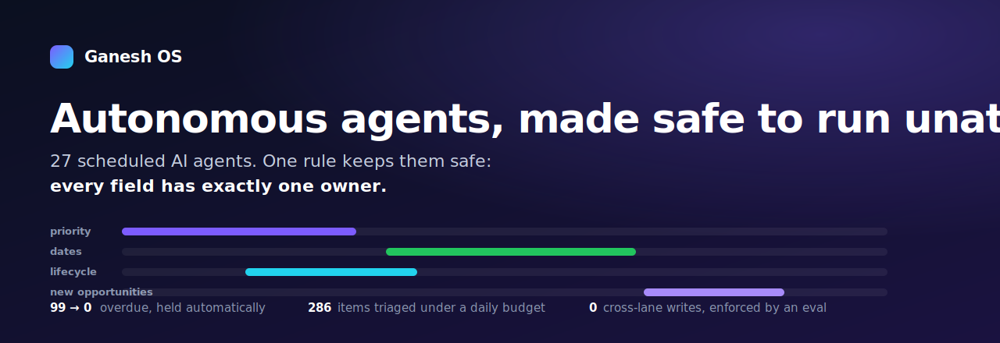
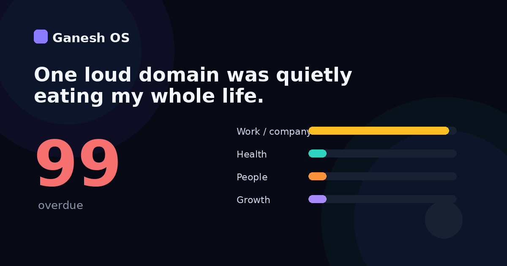

[](LICENSE)


[](https://github.com/gkmr/ganesh-os/actions/workflows/evals.yml)

<p align="center"></p>

**Ganesh OS is a personal AI operating system: software I run every day on my own life.** Twenty-seven small AI agents read my messages, calendar, and health data on a schedule, and each morning text me the single most important thing to do across work, health, the people I love, and my own growth. It is real software, running daily. It is not a startup, a concept, or a piece of art, and it sells nothing. This repo is the architecture and patterns only, with all personal data removed, plus a working example of how to make autonomous agents safe to run unattended.

**How it reaches me:** on the channels I already use: iMessage, SMS, WhatsApp, and email. Work pours in from all of them, and I reply in plain English to steer it. No app, no dashboard.

> **Why I built it.** Work has a Slack, a sprint board, an on-call alert. My health, the people I love, and my own growth shared a sticky note, so work always won and the quiet things slipped quietly. That was not a discipline problem, it was a coordination problem: many demands, one me, and no system holding the line. So I built 27 agents to run all of it as one governed system, and at 7:42 a.m. one text names the single thing that matters in each domain.

**[▶ Watch one day in motion (60s)](demo.html)**, or open the full site at **https://gkmr.github.io/ganesh-os/**: a plain problem, outcome, and how walkthrough up top, then the build for technical readers (the architecture, the 27-agent fleet, governance, memory, and case studies).

---

## The moment

It is 7:42 on a Tuesday. Before I have opened a single app, this text is already on my phone:

```
[brief] 🗓 Tue
MIT: ship the diligence memo before noon (it gates the IC vote).
Today: 1 work · ship memo. 2 health · 11am lift (only slot this week).
        3 people · call back the founder you went quiet on.
0 overdue. 11 real tasks. 6 things I handled while you slept.
```

While I slept, 27 agents read five message channels, reconciled six calendars, re-ranked every open item, cleared the overdue pile to zero, and decided — out of everything — that the memo, the lift, and the founder are what today is actually for. I did not plan that. The system did, and it can show its work for every line.

That is the product. The rest of this page is how it is built so you can trust it.

## Watch it decide, live

Prioritization here is not a pre-ranked chart. It is a choice made in front of you. This morning two things wanted the same slot:

- a **partner intro that could close a deal** (urgent, high value), and
- the **week's only workout** that protects a six-week streak (not urgent, easy to skip).

Pure urgency drops the workout. The system does not. The per-day budget says today is full; the cross-domain rule says health has had zero slots this week; so it keeps the intro **and** the lift, and pushes a "nice to read" newsletter to the backlog instead — and tells me why in one line. **[See it animate, step by step →](demo.html)** You watch it score and cut, not admire a finished ranking.

## What the AI actually does (and a rules engine can't)

The agents are AI-native on purpose. Language models do the judgment a rules engine can't: reading forty messages and surfacing the three that are real, summarizing a thread to one quote and the ask, deciding that "memo gates the IC vote" outranks "reply to a newsletter." Classical scheduling does the parts that must be exact: calendar math, alarm-sync, the per-day budget. The split is the design — **LLM judgment where nuance lives, deterministic code where correctness lives** — and it is what turns a pile of channels into one ranked decision you can act on by replying to a text.

---

## Under the hood: a governance layer

The hard part was never getting the agents to act. It was making a fleet of autonomous writers **safe to run unattended** — auditable, self-healing, and human-gated. Six concrete mechanisms, not slogans:

| Governance property | The mechanism |
|---|---|
| **Guardrails** | Single-writer fences: every mutable field has exactly one owning agent; an agent literally cannot write a field it does not own. |
| **Audit trail** | One append-only, source-tagged change log: every autonomous write is attributable to who, what, and why. |
| **Trust gate** | Behavioral evals run in CI; a change that regresses the invariants is blocked, not shipped. |
| **Self-healing** | Run-guards safe to re-run without double-writing (idempotent), degradable surfaces, and auto-park: it recovers from a missed run, a downed connector, or a backlog without a human. |
| **Governed change** | Self-improvement is snapshot-first, one change per iteration, human-approved — it proposes, it never auto-deploys. |
| **Human-in-the-loop** | Only irreversible actions (deletion, sending) are gated; everything reversible flows. |

The guardrail is enforced, not asserted. The actual check CI runs over the change log:

```python
# evals/lane_fence.py — fails on the first cross-lane write.
OWNER = {
    "priority":    {"pipeline-triage", "todo-triage"},
    "due_date":    {"morning-sweep", "evening-sweep"},
    "lifecycle":   {"reply-processor"},   # create / complete / reschedule
    "create_item": {"intake-scan"},
    "delete":      set(),                 # nobody: deletion is human-gated
}

def check_lane_fence(changelog):
    for e in changelog:
        owners = OWNER[e.field]
        assert e.agent in owners, f"CROSS-LANE: {e.agent} wrote {e.field}"
    return "PASS"   # a regression blocks the change and rolls back from a snapshot
```

Full depth: **[the governance model](docs/governance.md)** · **[architecture](ARCHITECTURE.md)** · **[the nine patterns](docs/design-patterns.md)**.

## Built with the full craft, not vibes

Every agent went through the loop an AI product and engineering org actually runs, and the repo is the receipt:

- **Define** — a one-page PRD per capability: the job to be done, non-goals, and the acceptance check (for the brief: "done when overdue is zero and the day is ranked one-per-domain").
- **Design** — the surface is wireframed as a phone-readable text *before* any logic; the output is the interface, so it is prototyped first.
- **Build** — a self-contained scheduled prompt that names the single field it may write; coordination happens through shared files, never shared state (see `agents/` and `agents/format-contract.md`).
- **Verify** — unit tests on the parsers, **behavioral evals** on the invariants in CI (`evals/`), a self-review against the format contract that stands in for **PR review**, and a **system-design note** that records each tradeoff and the rejected alternatives (`docs/design-patterns.md`, `ARCHITECTURE.md`).

This is the same discipline at the scale of one life that it is at the scale of a team: PRD, wireframe, prototype, unit tests, review, system-design pass, tradeoff log.

## The memory is the moat

Longitudinal context only helps if it is stored without rot and recalled without lying. Three ideas, made to run:

- **MemPalace** — a verbatim store that is never edited, plus **temporal validity windows**: a fact carries an "as of" and a "superseded by" stamp instead of being silently overwritten.
- **The Karpathy LLM-wiki substrate** (a file-layout convention from AI researcher Andrej Karpathy, adapted here for agent memory) — a `raw / wiki / index / log` layout with a read-first index, so an agent loads a small routing map before opening any full file, with explicit `ingest / query / lint` passes.
- **gbrain** — the second-brain layer the agents share through files; a memory-OS pattern where a weekly lint flags any fact older than its validity window for re-verification, so the system compounds instead of drifting.

This sits on the same line the whole design defends: **language-model judgment where nuance lives, deterministic code where correctness lives.** Full depth in **[docs/ai-depth.md](docs/ai-depth.md)**.

## Three judgment calls

Each is a governance decision, traced from symptom to root cause to fix in [docs/case-studies.md](docs/case-studies.md):

1. **Gate the irreversible, let the reversible flow.** A confirmation-gated loop never advanced, so work piled up. Fix: auto-recover everything reversible, human-gate only deletion.
2. **Prioritization without distribution is just a different pile.** A bulk re-tier overloaded one day. Fix: a per-day budget plus spread, and a slot per domain so none starves.
3. **A notification is only useful if the reply path is as cheap as the alert.** A surfacing layer that dead-ended became an action surface via a manifest and reply-by-text.

## Why governance is the hard part

Agents are shipping into production faster than anyone can govern them, and "trust" is being asserted in slide decks rather than enforced in code. Single-writer ownership, an append-only audit trail, evals-as-CI-gate, and irreversible-only human gating are a working answer to the open problem: real autonomy that stays auditable, recoverable, and trusted. Here, that answer runs unattended every day: the evals gate every change and the audit trail is one queryable log.

## Getting started

```bash
git clone https://github.com/gkmr/ganesh-os
cd ganesh-os

# 1. Watch the governance checks pass (this is the trust gate, runnable)
pip install pytest && pytest evals/ -q

# 2. Open the product — the animated day  (live: https://gkmr.github.io/ganesh-os/demo.html)
open demo.html            # or just double-click it; no build, no deps

# 3. Read how an agent is built, and the contract they share
#    agents/  (sanitized example prompts + the manifest schema)
```

This is a design repo, not an installable app: the live system runs on a desktop AI-agent runtime against personal connectors (Apple Reminders, Calendar, Slack, Gmail, and others), which is intentionally not included. To **adopt the pattern**, start with `agents/` and `evals/`, then apply the single-writer fence to your own agent stack — give every mutable field one owning agent and enforce it with a lane-fence check in CI. See [`CONTRIBUTING.md`](CONTRIBUTING.md).

To run the showcase as a live site, enable **GitHub Pages** (Settings → Pages → `main` / root); `index.html` and `demo.html` then serve at `https://gkmr.github.io/ganesh-os/`.

## Who runs this — and what they lead

Built by **Ganesh Kumar**, an operator-investor. Two roles, one discipline:

- **VC partner (invest)** — backing AI-native companies: sourcing, technical and governance diligence, hands-on portfolio support.
- **Fractional CPO / CTO (build)** — leading the **AI/ML product**, **platform engineering**, **design**, and **go-to-market** functions for AI-native teams.

Scope, generalized so the repo stays clean: AI product leadership at **billions-scale** consumer platforms; GM of a consumer-hardware line past **$300M ARR**; CPO/CTO who scaled a **fraud-detection** company. Ganesh OS is that same job — AI product, platform, design, GTM, and the governance that makes autonomy safe — compressed to the scale of one life. Full detail in **[docs/operator.md](docs/operator.md)**.

Open to **board & advisory roles, fractional CPO/CTO engagements, panels & talks, and angel investing / diligence** on making autonomous AI auditable and safe. The reusable core is the single-writer fence (one agent owns each field, enforced in CI); fork it, and if you build something with it, an issue or a link is welcome.

**Contact:** [gkmr@umich.edu](mailto:gkmr@umich.edu) · [linkedin.com/in/reachgkumar](https://www.linkedin.com/in/reachgkumar)

## What's in here

| Path | What it is |
|---|---|
| [`index.html`](index.html) | The full site: a plain problem / outcome / how walkthrough, then the build (best via GitHub Pages) |
| [`demo.html`](demo.html) | The animated day — the product, in 60 seconds |
| [`docs/operator.md`](docs/operator.md) | Who runs this: the two roles, the functions led, and the throughline |
| [`docs/ai-depth.md`](docs/ai-depth.md) | What makes it AI-native: the model/correctness split, multimodal channels, the memory moat (MemPalace, the Karpathy LLM-wiki, gbrain) |
| [`docs/craft.md`](docs/craft.md) | The PM/eng craft: PRD, wireframe, prototype, tests, PR review, system-design tradeoffs |
| [`docs/governance.md`](docs/governance.md) | The six governance properties, in depth |
| [`docs/decisions.md`](docs/decisions.md) | Architecture decision records — context, options, verdict, consequences |
| [`ARCHITECTURE.md`](ARCHITECTURE.md) | Layers, fences, daily data flow, failure modes |
| [`docs/harness.md`](docs/harness.md) | Harness engineering: scheduler, context, tools, contract, log, evals — and how agents/skills/memory plug in |
| [`docs/case-studies.md`](docs/case-studies.md) | Three governance decisions, end to end |
| [`docs/design-patterns.md`](docs/design-patterns.md) | The nine patterns + tradeoffs and alternatives |
| [`docs/agent-catalog.md`](docs/agent-catalog.md) | All 27 agents and the one field each owns |
| [`evals/`](evals/) | The real behavioral checks, run in CI |
| [`agents/`](agents/) | Sanitized example agent prompts + the manifest schema |

## No personal data

Architecture and patterns only, authored in a generalized voice and scanned for PII ([review](docs/SECURITY-SCAN.md)). The live personal system is not included.

> If the single-writer-fence idea is useful to you, a ⭐ helps others find it.
