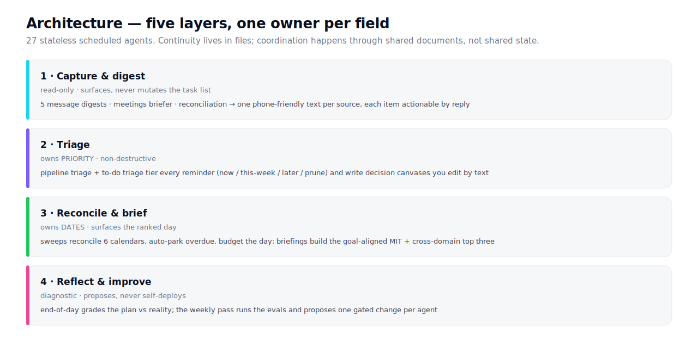

The dark schematic surface for diagrams. Frame a real in-palette SVG (the repo's `architecture.svg`, `hero.svg`, `system-flow.html`) inside it. Never hand-draw new iconography.

```jsx
<DiagramFrame title="System architecture" caption="Layers, fences, and the daily data flow.">
  
</DiagramFrame>
```

Wide diagrams scroll horizontally rather than shrink. Pair with the brand's schematic-only diagram rule.
